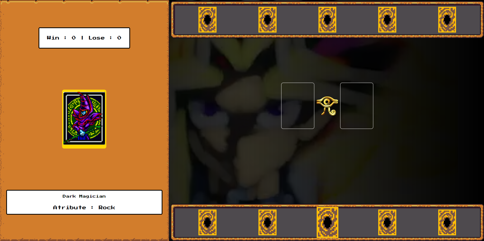

# Yu-Gi-Oh | Jo-ken-po Edition

Jogo de jokenpo criado com HTML, CSS e JavaScript

## 📖 Sobre

Um jogo de Jo-ken-po (Pedra, Papel e tesoura) feito com a temática de Yu-Gi-Oh.

## 🛠 Recursos utilizados

- HTML e CSS para a estrutura da página e aparência.
- JavaScript para o funcionamento das mecânicas do jogo.

## 🖼 Visão geral

## 📁 Referências

- [DIO JavaScript Yu-Gi-Oh](https://github.com/digitalinnovationone/js-yugioh-assets)
